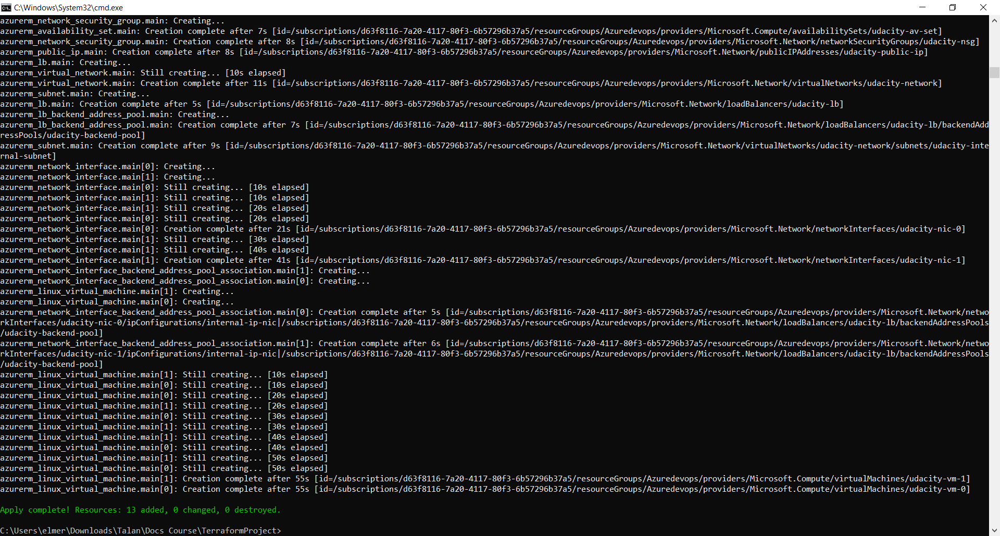
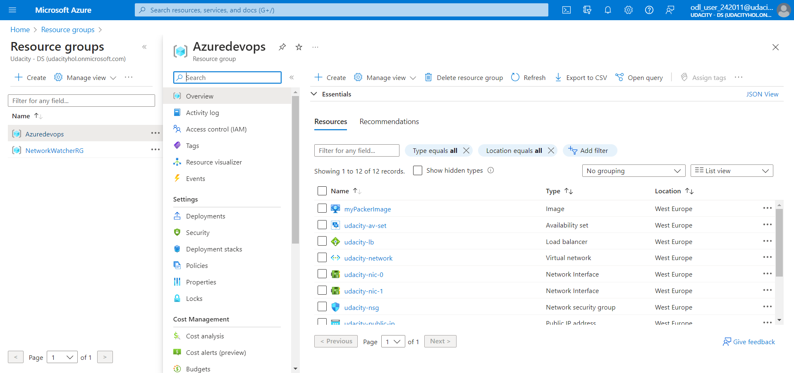

# Azure Infrastructure Operations Project: Deploying a scalable IaaS web server in Azure

### Introduction
For this project, you will write a Packer template and a Terraform template to deploy a customizable, scalable web server in Azure.

### Getting Started
1. Clone this repository to your local machine.
```sh
git clone <repository_url>
```

2. Deploy your infrastructure as code by following the instructions provided in the next sections.

### Dependencies
Before you begin, ensure that you have the following dependencies set up:

1. Create an [Azure Account](https://portal.azure.com) 
2. Install the [Azure command line interface](https://docs.microsoft.com/en-us/cli/azure/install-azure-cli?view=azure-cli-latest)
3. Install [Packer](https://www.packer.io/downloads)
4. Install [Terraform](https://www.terraform.io/downloads.html)

### Instructions

Follow these instructions to deploy an scalable web server infrastructure in Azure using Packer, Terraform and the Azure CLI.

1. Log into your Azure account in the CLI using one of the following options:
    
- **Option a**: Run the following command, which will open a web page in your default web browser, allowing you to enter your Azure credentials:

```sh
az login
```

- **Option b**: Enter your credentials manually within the following command, replacing `<username>` and `<password>` with your Azure account information:

```sh
az login -u <username> -p <password>
```

2. To enforce tagging policies on all indexed resources, create an Azure Policy using the provided `policy.json` file. Execute the following command:

```sh
az policy definition create --name tagging-policy --rules policy.json
```

3. Apply the policy definition to the subscription with the name "tagging-policy":
```sh
az policy assignment create --name tagging-policy --policy tagging-policy
```

4. Create a Resource Group to store your Packer images. Execute the following command:
    - You can replace the `location` with your desired location.  

```sh
az group create --name Azuredevops --location westeurope --tags "application=webserver"
```

5. To be able to build the Packer image, configure the `server.json` file with your Azure credentials. Specifically, you should provide values for the variables `client_id`, `client_secret`, `subscription_id`, and `location`, which can be obtained from your Azure Portal with the corresponding names:

    - `client_id` = Application Id
    - `client_secret` = Secret Key 
    - `subscription_id` = Subscription Id
    - `location` = Location used in step 4.

6. Run the following command to build the custom image for the Virtual Machines.
```sh
packer build server.json
```

7. Run the following command to initialize your Terraform working directory. 
```sh
terraform init
```

8. **(OPTIONAL)** To customize your deployment, you can modify the default values of variables within the `variables.tf` file. This allows you to tailor specific parameters to your preferences. Variables you can adjust include:

- `count_vm`: To set the number of Virtual Machines to be created.
- `location`: To set the desired deployment location for your Azure resources.
- `password`: To specify the password for the Virtual Machines.
- `username`: To specify the username for the Virtual Machines.

9. To use the custom image and resource group we previously created, we need to import the resource group. Run the following command:

    - Don't forget to replace `<subscription_id>` with your Subscription Id  

```sh
terraform import azurerm_resource_group.Azuredevops /subscriptions/<subscription_id>/resourceGroups/Azuredevops
```

10. To create an execution plan and save it as well as analyze the changes to be applied run the following command:
```sh
terraform plan -out solution.plan
```
11. Input the `prefix` as it will be requested by the CLI, which should be used for all resources in this example.

12. Create the web server infrastructure by running the command:
```sh
terraform apply solution.plan
```

13. Once you are finished and wish to destroy all the resources created by Terraform, execute the following command:
```sh
terraform destroy
```

### Outputs
After step 12, you will have your full infrastructure deployed, ready to use, and it should resemble something like this:

**Apply Output:** Here is what the successful apply output should look like in your CLI:



 **Resources Group:** Here you can see all the resources that were created, such as Virtual Machines, Load Balancer, Network Interfaces, Public IP Address, Virtual Network, Availability Set, Custom Image, and Disks.



----------
- In the present example, 2 Virtual Machines were created, but you should have as many as you define.


-----
- Also, here is how your Network Security Group should look:


